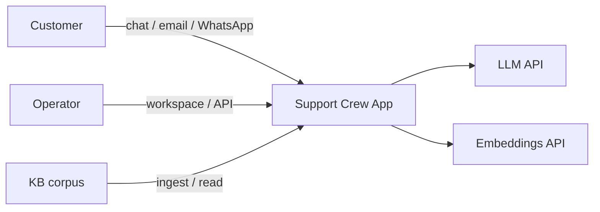
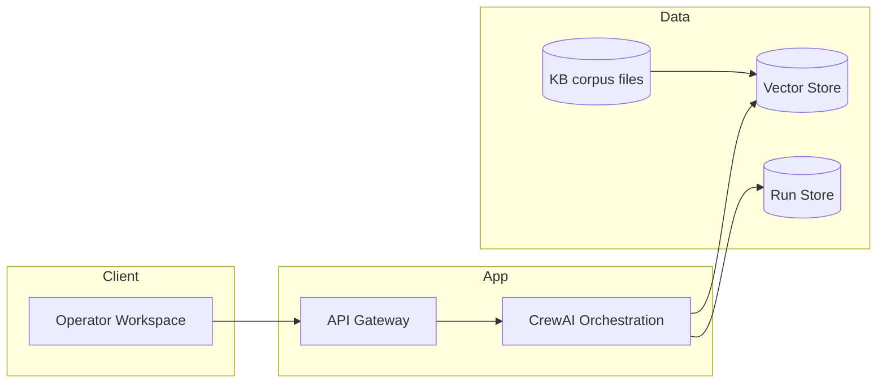
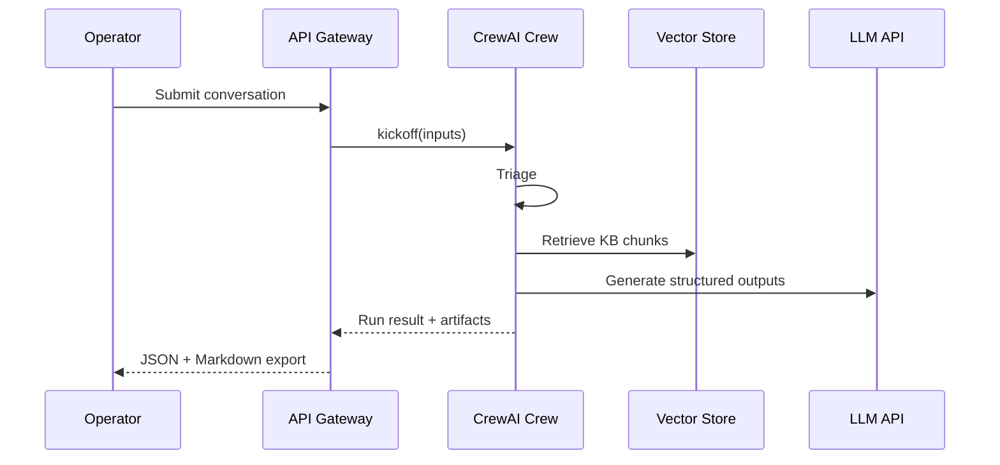
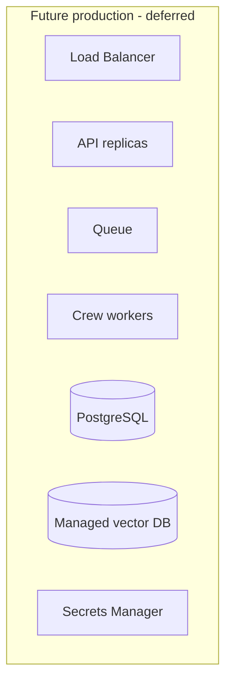

# System Architecture Document (SAD): Multi-Agent Customer Support Crew

**Project**: Multi-Agent Customer Support Crew (Capstone)  
**Version**: 1.0  
**Date**: 2026-05-04  
**Owner**: System Architect (@system.arch)  
**Resolved runtime**: `crewai` (per `AAMAD_TARGET_RUNTIME` / PRD)  
**Status**: High-level architecture for MVP (Define phase)

---

## 1. Introduction

### 1.1 Purpose

This document specifies the **high-level system architecture** for the Multi-Agent Customer Support Crew. It bridges product intent (MRD/PRD) and implementation: boundaries between components, data flows, key interfaces, quality attributes, and deferred work.

### 1.2 Scope

**In scope (MVP)**:

- Multi-channel intake: **web chat**, **email**, **WhatsApp** (normalized to a single internal conversation model; WhatsApp may be simulated per PRD assumptions).
- CrewAI **sequential** orchestration of specialized agents: triage → retrieval → sentiment/tone → resolution → (conditional) escalation → KB improvement proposal.
- **RAG** over a curated knowledge base with **citations** and confidence.
- **Helpdesk-ready artifacts** (JSON + Markdown); **no** helpdesk API in MVP.
- Operator workspace (minimal UI) and audit-friendly run logs.

**Out of scope (MVP)**:

- Helpdesk ticket create/update APIs (P1).
- Long-lived cross-session customer memory (P1/P2).
- Voice, proactive outbound, multimodal (P2).

### 1.3 Definitions

| Term | Definition |
|------|-------------|
| **Crew** | CrewAI orchestration unit executing agents and tasks in a defined process. |
| **Evidence pack** | Structured retrieval output: KB chunk IDs, excerpts, scores, and metadata for citation. |
| **Escalation packet** | Human-readable + machine-parseable handoff artifact for operators or future ticketing systems. |
| **Channel adapter** | Component that maps external channel payloads into the internal `ConversationMessage` schema. |

### 1.4 References

| Document | Path |
|----------|------|
| MRD | `project-context/1.define/mrd.md` |
| PRD | `project-context/1.define/prd.md` |
| AAMAD SAD template (optional implementation stack) | `.cursor/templates/sad-template.md` |

---

## 2. Architectural Drivers & Constraints

Drivers derived from MRD/PRD:

| Driver | Implication on architecture |
|--------|------------------------------|
| **Grounding & hallucination control** | Separate retrieval from generation; enforce citation contract; refuse or escalate when evidence is below threshold. |
| **Trust & transparency** | Disclose AI in UI; easy escalation path; log rationale for routing and escalation. |
| **Determinism & evaluability** | Sequential crew; bounded iterations; reproducible prompts/config versioning. |
| **Multi-channel** | Channel adapters + single canonical message model; shared downstream pipeline. |
| **No helpdesk MVP** | Stable **artifact schemas** (JSON) as the integration boundary for P1. |
| **Performance (PRD)** | P95 targets for first response and full response; async-friendly design for LLM/RAG latency. |
| **Privacy** | PII minimization, redaction hooks, configurable retention. |

**Hard constraints**:

- Secrets only via environment variables (no secrets in repo or logs).
- High-risk intents (legal, security, etc.) must not receive unsupervised autonomous “resolution” that asserts policy; escalate or clarify only.

---

## 3. Stakeholders & Architectural Concerns

| Stakeholder | Concerns |
|--------------|----------|
| Support operator | Fast drafts, visible citations, editable output, export artifacts. |
| Support lead / QA | Consistency, audit trail, policy adherence, testability. |
| Customer (indirect) | Accurate answers, empathy when frustrated, path to human. |
| Platform / DevOps | Deployability, observability, cost of LLM/RAG. |
| Security / Compliance | PII handling, data retention, access control (future). |

**Quality attributes** (prioritized for MVP):

1. **Correctness / safety** (grounding, escalation)  
2. **Explainability** (citations, confidence, routing reasons)  
3. **Performance** (P95 latency)  
4. **Maintainability** (YAML agents/tasks, clear module boundaries)  
5. **Operability** (structured logs, run IDs)

---

## 4. System Context (C4 Level 1)

**System**: Multi-Agent Customer Support Crew application.

**External actors & systems**:

- **Operator** — uses workspace UI or API to submit inquiries and export artifacts.
- **Customer** — interacts via chat widget, email, or WhatsApp (ingestion path may be manual paste or simulated webhook in MVP).
- **LLM provider** — completion / chat API for agent reasoning.
- **Embedding provider** — embeddings for KB indexing and query encoding (may be same vendor as LLM).
- **Knowledge base corpus** — source documents (e.g. Markdown/PDF in repo or object storage); ingested into vector index.



---

## 5. Architectural Decisions (Summary)

| ID | Decision | Rationale | Alternatives deferred |
|----|----------|-----------|------------------------|
| AD-01 | **CrewAI** as orchestration runtime | PRD/MRD; YAML-friendly agent/task externalization per AAMAD adapter. | LangGraph-only custom orchestrator |
| AD-02 | **Sequential** process for MVP | Determinism, easier testing, clearer task context chain. | Hierarchical/delegating crew (P2 if justified) |
| AD-03 | **Retrieve-then-generate** pipeline | Mitigates hallucination; matches PRD “evidence first.” | End-to-end single-agent prompt |
| AD-04 | **Artifact-first** integration boundary | No helpdesk in MVP; stable JSON contracts unlock P1 integrations. | Direct ServiceNow/Zendesk in MVP |
| AD-05 | **Channel adapters** internal pattern | Uniform crew input regardless of channel. | Separate crews per channel |
| AD-06 | **Vector RAG** for KB | PRD P0-F3; industry-standard pattern. | Keyword-only search (insufficient for MVP goals) |

---

## 6. Container View (C4 Level 2 — Logical Deployables)

Recommended MVP **logical containers** (physical mapping can vary: monolith vs split services).

| Container | Responsibility |
|-----------|------------------|
| **Web / API gateway** | Serves operator UI; exposes REST (or tRPC) endpoints: `POST /runs`, `GET /runs/:id`, export. Auth optional for capstone demo. |
| **Orchestration service (Crew runtime)** | Loads `agents.yaml` / `tasks.yaml`, executes crew, aggregates outputs, writes run record. |
| **KB ingestion job** | Offline or admin-triggered: chunk, embed, upsert vector store. |
| **Vector store** | Stores embeddings + metadata (chunk id, source doc, section). |
| **Run store** | Persists run inputs, intermediate JSON, final artifacts, timings (SQLite for demo; PostgreSQL for production path). |



**Reference implementation note** (from `.cursor/templates/sad-template.md`): A common AAMAD Phase 2 stack is **Next.js (App Router) + API routes** for the gateway and **Python** process or sidecar for CrewAI. This SAD stays stack-agnostic at the logical level; the build phase may bind to that template explicitly.

---

## 7. Multi-Agent Logical Architecture (CrewAI)

### 7.1 Agent responsibilities (mapping to PRD §3.2)

| Agent | Primary outputs | Downstream consumers |
|-------|-----------------|------------------------|
| Triage | `intent_label`, `priority`, `risk_flags`, `routing_decision`, `confidence` | Retriever, Sentiment (parallel or ordered per task graph), Escalation |
| Knowledge Retriever | `evidence_pack` (top-k, citations) | Resolution, Escalation |
| Sentiment & Tone | `sentiment_score`, `tone_guidance`, `escalation_recommendation` | Resolution, Escalation |
| Resolution | `draft_answer`, `required_clarifications`, `citations_used`, `confidence` | Escalation (if triggered), KB Improvement |
| Escalation Manager | `escalation_packet` | Export / operator |
| KB Improvement | `kb_change_proposal` | Export / operator approval queue |

### 7.2 Task orchestration (sequential MVP)

Recommended **task chain** (explicit `context` chaining in CrewAI tasks):

1. **Normalize intake** — validate `ConversationMessage` schema; attach `run_id`.
2. **Triage** — intent, priority, risk flags; if **hard escalate** (e.g. legal/security), skip resolution and go to escalation-only branch.
3. **Retrieve evidence** — query vector store; produce `evidence_pack`; handle empty/low-score paths per policy.
4. **Sentiment & tone** — derive tone guidance; may increase escalation propensity.
5. **Resolve or clarify** — if evidence sufficient: draft grounded answer; else clarifying questions or soft escalation recommendation.
6. **Escalation (conditional)** — if triggers fire: materialize `escalation_packet`.
7. **KB gap proposal (conditional)** — if gap detected: `kb_change_proposal` with `status: draft`.



### 7.3 Delegation & memory (MVP)

- **Delegation**: `allow_delegation=false` for MVP unless SAD amendment documents hierarchical flow.
- **Memory**: session-scoped conversation text passed in task inputs; **no** long-term memory store in MVP (per PRD).

### 7.4 Guardrails (cross-cutting)

Implement as **policy module** (pure code or rules file) consumed by Triage/Resolution/Escalation:

- Risk flag → **block autonomous policy assertions**; force escalation packet or clarifications only.
- Evidence score threshold → no definitive answer without citations.
- Max clarification rounds → escalate.

---

## 8. Data Architecture

### 8.1 Canonical intake schema (conceptual)

```json
{
  "channel": "web_chat | email | whatsapp",
  "customer_message": "string",
  "customer_identifier": "string | null",
  "thread_id": "string | null",
  "timestamp": "ISO-8601",
  "locale": "en"
}
```

### 8.2 Core persisted entities (Run store)

| Entity | Key fields |
|--------|------------|
| **Run** | `run_id`, `created_at`, `channel`, `status`, `latency_ms`, `model_id` |
| **RunArtifact** | `triage`, `evidence_pack`, `sentiment`, `resolution`, `escalation_packet?`, `kb_change_proposal?` |
| **AuditEvent** | `type`, `payload_ref`, `timestamp` (citations, escalation triggers) |

### 8.3 Vector index metadata (per chunk)

- `chunk_id`, `document_id`, `title`, `uri`, `version`, `text_excerpt`, `embedding_version`

### 8.4 Helpdesk-ready artifacts (integration boundary)

Stable JSON exports (names illustrative; exact schema fixed in build):

- `artifacts/triage.json`
- `artifacts/evidence_pack.json`
- `artifacts/resolution.json`
- `artifacts/escalation_packet.json` (optional)
- `artifacts/kb_change_proposal.json` (optional)
- `artifacts/run_summary.md` (human-readable bundle)

P1 helpdesk adapters **map** these fields to vendor ticket JSON.

---

## 9. Interface Specifications (MVP)

### 9.1 Internal: Operator API (REST-style)

| Operation | Description |
|-----------|-------------|
| `POST /api/runs` | Body: normalized conversation + optional operator notes; returns `run_id`. |
| `GET /api/runs/:run_id` | Returns structured artifacts + status. |
| `GET /api/runs/:run_id/export` | Returns zip or multipart: JSON + Markdown. |

Validation: reject oversized payloads; sanitize attachments if added later.

### 9.2 External: LLM / embeddings

- Versioned prompts and model IDs recorded per run (Audit).
- Timeouts and retries with exponential backoff; idempotent `run_id` for safe client retries.

### 9.3 WhatsApp / email (MVP)

- **Simulation path**: operator pastes thread or webhook payload into workspace.
- **Future path**: Meta WhatsApp Cloud API webhook → API gateway → same canonical schema (P1; see MRD Meta references).

---

## 10. Deployment View (MVP)

**Capstone / demo deployment** (typical):

- Single VM or local docker-compose: `api` + `worker` (optional) + `vector_db` + `object_store_or_volume` for KB files.
- Environment: `.env` for API keys; no secrets in artifacts.

**Production-oriented** (deferred):

- Managed PostgreSQL, managed vector DB, secrets manager, horizontal scaling of stateless API + queue-backed crew workers.



---

## 11. Security, Privacy, Compliance

| Area | MVP approach |
|------|----------------|
| **Transport** | TLS for all external calls. |
| **Secrets** | Env vars only; never log API keys or customer secrets. |
| **PII** | Minimize fields; optional redaction pass on `customer_message` before persistence. |
| **Transparency** | UI copy: “AI-assisted”; link or tooltip to escalation. |
| **Audit** | Store citations, confidence, risk flags, escalation triggers per PRD. |
| **Compliance** | GDPR/LGPD etc. **TBD** per PRD Open Questions; architecture leaves hooks for retention purge and export. |

---

## 12. Observability & Operations

| Signal | Implementation hint |
|--------|---------------------|
| **Structured logs** | JSON logs with `run_id`, `agent`, `task`, `duration_ms`. |
| **Metrics** | Counters: runs, escalations, retrieval misses; histograms: latency per stage. |
| **Tracing** | Optional OpenTelemetry spans around crew kickoff and tool calls. |
| **Cost** | Token usage estimate per run (for capstone reporting). |

---

## 13. Performance & Reliability (NFR mapping)

| PRD NFR | Architectural mechanism |
|---------|---------------------------|
| P95 first meaningful response ≤ 10s | Parallelize retrieval + embedding cache; streaming partial results to UI (optional); cap `top_k` and context size. |
| P95 full response ≤ 20s | Same + avoid redundant LLM calls between tasks (cache structured triage JSON in task context). |
| 50–200 concurrent conversations | Stateless API + worker pool + queue (when scaling beyond demo). |
| Graceful degradation | If vector store down: return structured error + escalation recommendation; do not fabricate KB answers. |

---

## 14. Risks & Mitigations

| Risk | Mitigation |
|------|------------|
| Hallucinated policy | Citation enforcement + refusal + escalation (PRD). |
| Weak KB | Ingestion quality checks; KB improvement loop; operator feedback. |
| Channel-specific quirks | Isolate in adapters; keep crew channel-agnostic. |
| Vendor lock-in on LLM | Abstract provider behind thin interface; record model/version per run. |

---

## 15. Traceability (PRD → Architecture)

| PRD ID | Architectural element |
|--------|------------------------|
| P0-F1 | Channel adapters + canonical schema |
| P0-F2 | Triage agent + guardrail policy module |
| P0-F3 | Vector RAG + evidence_pack contract |
| P0-F4 | Resolution agent + citation validation step |
| P0-F5 | Escalation Manager + `escalation_packet` schema |
| P0-F6 | KB Improvement agent + conditional task |
| P1-F1 | Future adapter: HelpdeskConnector |
| P1-F2 | Future store: CustomerContext + consent metadata |

---

## 16. Deferred & Future Work

- Helpdesk API integration (P1).
- Persistent customer memory with consent (P1/P2).
- Full operator console workflows (P1).
- Voice, proactive, multimodal (P2).
- Hierarchical CrewAI process only if justified in a revised SAD with Audit note.

---

## Sources

- `project-context/1.define/mrd.md`
- `project-context/1.define/prd.md`
- `.cursor/templates/sad-template.md` (reference stack patterns for Phase 2 build)

---

## Assumptions

- `AAMAD_TARGET_RUNTIME=crewai` for the implemented MVP.
- KB corpus is available at build/deploy time for indexing.
- English-only processing for MVP NLP paths.

---

## Open Questions

1. **Frontend stack**: Confirm Next.js + assistant-ui vs minimal SPA for capstone (template suggests Next.js).
2. **Vector DB choice**: local Chroma vs managed Pinecone/pgvector, etc.
3. **Deployment target**: local-only vs containerized demo vs cloud MVP.
4. **Compliance**: any hard requirement affecting data residency or PII redaction defaults?

---

## Audit

- **Timestamp**: 2026-05-04  
- **Persona**: `@system.arch`  
- **Action**: Drafted high-level SAD in `project-context/1.define/sad.md` from `mrd.md` and `prd.md`.  
- **Resolved runtime**: `crewai` (recorded for downstream SAD/SFS and adapter alignment).
